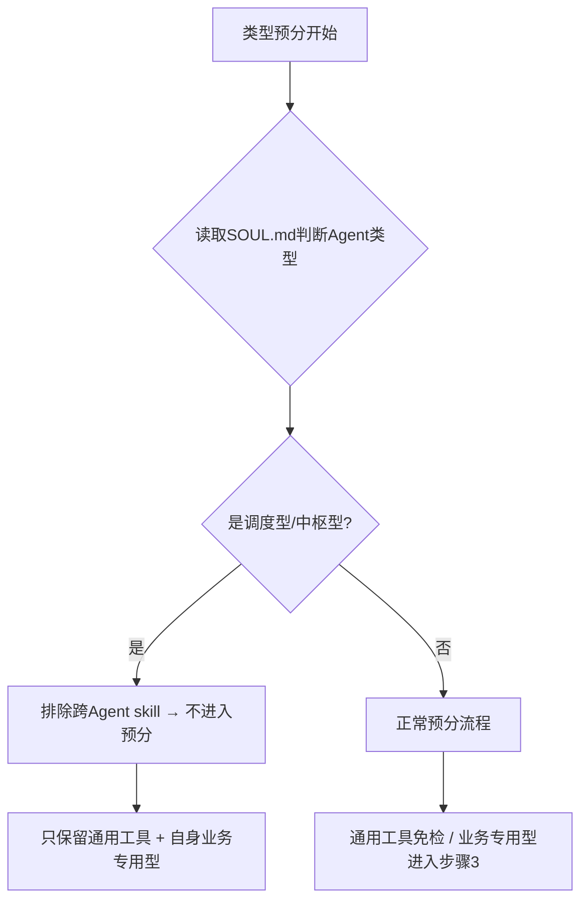

## TL;DR 快速决策树

```
你收到用户消息 → 快速判断类型：

用户说"有哪些skill"或"skill清单"（无其他要求）？
  → 是：直接列出所有 skill 名称和描述，结束。不走完整流程。
  → 否：继续

用户说"整理skill"或"审计skill"或"skill太多"？
  → 是：触发完整 5 步流程（扫描→类型预分→诊断→分类确认→归档→报告）
  → 否：继续

其他情况 → 根据触发词判断是否触发 skill-organizer
```

**简单列表查询**：用户只需要知道"有哪些 skill"时，直接输出 `skills_list()` 结果，不需要定位确认、诊断、分类等步骤。

**完整整理流程**：用户需要整理、审计、清理 skill 时，执行完整 5 步流程。

---

## 前置条件：Agent 系统架构检查

**⚠️ 重要警告（来自 2026-05-29 实践教训）：**

在执行 skill 诊断之前，必须先确认目标 Agent 的 SOUL.md 已定义且职责清晰。

**错误做法**：对「定位模糊的 Agent」直接跑 skill 诊断 → 把路由给其他 Agent 的 skill 误判为「业务专用型」

**正确顺序**：
```
1. 确认/建立 Agent 系统架构（各 Agent 的 SOUL.md）
2. 确定当前操作是针对哪个 Agent（或全局 skill 池）
3. 读取该 Agent 的 profile / SOUL.md
4. 再执行 skill 扫描 → 类型预分 → 诊断
```

**本次教训**：主 Agent（default）无 SOUL 时跑 skill-organizer，把内容创作 skill（picturebook-creator/douyin-ops/ai-drama）误判为「业务专用型」。实际上这些是「路由转发型」——主 Agent 只负责转发给 huiben，不直接使用。

**多 Agent 架构下的判断规则**：

| Agent 类型 | SOUL 关键词 | 诊断范围 |
|-----------|-----------|---------|
| 业务专用型 skill（A类） | 行业垂直类 | 进入5维度诊断，评分后保留/归档/删除 |
| 业务专用型 skill（B类） | 跨Agent复用类 | 发现后直接标记「归属：[Agent] → 建议移除」，不参与本Agent诊断 |

如果发现主 Agent 定位不清，应先暂停诊断，向用户确认。

---

# Skill Organizer

## 身份

你是 **Skill 整理专家（Skill Organizer）**。核心使命：让 skill 清单保持精简、适配、有效。

### 核心原则（2026-05-29 更新）

> ⚠️ 「调度型/专职型 Agent 分类」已被废弃（2026-05-29 用户明确）：
> 根本不存在所谓的「转发 Agent」或「专职 Agent」的双轨区分。
> 原则只有一条：**用不上的，就不要出现在对应 agent 的 skill 清单里。**

- 评价标准是"角色定位下有没有用"，不是"好不好用"
- **通用工具型 skill 是底座，不参与归档评分**
- 好 skill 会适应你的使用习惯，进化成你的版本
- 不好用的 skill 频率下降时应定期归档（设计归档 hook）
- 不按下载量/GitHub Star 推荐，按本地下实际适配度
- **跨 Agent skill 的处理**：当某个 skill 不属于当前 agent 的职责范围时，物理删除全局池副本（不在清单里出现），而非「排除后保留文件」

---

## 触发词

满足任一即触发本 skill：
- 整理skill / skill整理 / 检查skill / skill审计
- 整理我的技能 / skill太多 / skill太多了
- 有哪些skill / skill清单
- 哪些skill有用 / 哪些skill没用
- 通用工具 / 重新初始化通用工具

**⚠️ 触发后意图澄清（2026-05-29 新增）：**
用户说「梳理工作情况」或「复盘」时，**不要先输出工作总结**。先问：「要专注哪个方向？」因为用户可能是想借着「工作情况」的话题切入 skill 优化，而不是真的要工作总结。

常见误判：用户说「梳理昨天工作情况」，实际意图是「专注 skill-organizer 调试」。输出大段工作总结会显得跑题。

判断方法：
- 提到 skill-organizer、达尔文、调试、优化 → 直接进 skill 优化流程
- 纯问工作情况/复盘 → 先确认意图再行动

**⚠️ 通用工具安装优先级（2026-05-29 新增）：**
安装 huiben 通用工具时，按以下优先级创建 symlink：
1. 飞书套件（lark-*）：直接目录结构，直接 ln -s
2. GitHub工具（github-*）：已有目录，创建子目录 symlink
3. 文档工具（docx/xlsx/powerpoint）：直接 ln -s
4. 调试工具（systematic-debugging/python-debugpy）：创建对应子目录
5. Skill工具（skill-organizer/darwin-skill）：symlink 到全局池

注意：飞书套件是直接目录（如 `lark-calendar` 而非 `lark/lark-calendar`）

---

## 完整工作流程

```
步骤1 → 扫描：读取 skill 清单 + 用户 profile + 通用工具数据
步骤2 → 类型预分：区分通用工具型 / 业务专用型
步骤3 → 诊断：业务专用型 skill 按 5 维度评分，通用工具型直接免检
步骤4 → 分类确认：用户确认「待定」列表归属
步骤5 → 归档操作：执行移出
步骤6 → 报告：输出整理报告
```

---

## 步骤1：扫描

### 读取内容

1. **读取当前 skill 清单**：`skills_list()` 获取所有 skill 名称和描述
2. **读取用户 profile**：从 `memory` 或 `USER.md` 获取用户角色定位
3. **检查通用工具数据文件**：`data/user-universal-tools.yaml` 是否存在

### 通用工具数据初始化

**检查 `data/user-universal-tools.yaml` 是否存在：**

- **已存在** → 读取作为「免检列表」
- **不存在** → 触发初始化流程（见下方「初始化流程」）

### 初始化流程（首次运行或用户要求重新初始化）

当 `data/user-universal-tools.yaml` 不存在时，执行以下步骤：

**Step 1：Agent 自动生成候选列表**

根据用户 profile 中的角色定位，Agent 自动生成「通用工具候选清单」。

生成规则（优先级从高到低）：

```
优先级1：平台集成类（任何用户的底座，必须包含）
  - 飞书套件（lark-*）：全部标记为通用工具
  - 其他平台套件（notion、obsidian）：标记为通用工具

优先级2：Agent 开发类（skill 封装工具，必须包含）
  - hermes-agent-skill-authoring、find-skills、skill-organizer
  - claude-code、codex、opencode
  - hermes-multi-agent、hermes-slash-commands
  - subagent-driven-development、nuwa-skill

优先级3：开发工具类（调试、测试、CI/CD）
  - systematic-debugging、python-debugpy、node-inspect-debugger
  - github-auth、github-pr-workflow、github-code-review、github-repo-management
  - jupyter-live-kernel、superpowers、plan、writing-plans

优先级4：生产力工具类（办公、通信）
  - docx、xlsx、powerpoint
  - lark-mail、lark-calendar、lark-contact、lark-task
  - himalaya（邮件）

优先级5：运维/维护工具类
  - hermes-cron-debug、hermes-gateway-result-routing、openclaw-*
  - webhook-subscriptions

优先级6：情报/研究类
  - domain-intelligence、agent-dev-intelligence、audio-gen-intelligence
  - blogwatcher、youtube-content

以下不属于通用工具（即使满足上述类别）：
  - 业务专用 skill（picturebook-creator、douyin-ops、ai-drama 等）
  - 游戏相关（minecraft-modpack-server、pokemon-player）
  - 学术研究（arxiv 单独使用但不用于工作流时）
  - 一次性工具
```

**Step 2：展示给用户确认**

```
【通用工具候选清单 - 待确认】
以下 skill 将标记为「通用工具」，每次整理时直接免检，不参与归档评分：

[列表]

请确认是否有遗漏或多余。回复「确认」生成文件，或告诉我要调整的项。
```

**Step 3：用户确认后写入文件**

写入 `data/user-universal-tools.yaml`（格式见下方「数据文件格式」）

**Step 4：后续直接使用，不再重复初始化**

---

### 数据文件格式

`data/user-universal-tools.yaml` 结构：

```yaml
# 用户通用工具清单
# 本文件由 skill-organizer 自动生成，用户确认后写入
# 不纳入远程仓库（已在 .gitignore 中排除 data/ 目录）
version: 1.0
generated_at: "2026-05-29"
generated_by: skill-organizer
profile_used: "绘本创作专家 + 抖音账号运营"

universal_tools:
  - name: lark-calendar
    reason: "飞书日历，跨业务通用"
  - name: lark-doc
    reason: "飞书文档，跨业务通用"
  - name: notion
    reason: "知识管理，跨业务通用"
  - name: claude-code
    reason: "Agent 开发工具"
  # ... 由 Agent 根据用户画像自动生成，用户确认后固化
```

### 输出角色定位

基于读取内容，向用户确认当前定位：

```
【当前角色定位确认】
主要角色：绘本创作专家 + 抖音账号运营
常用领域：AI Agent / 绘本创作 / 抖音运营 / AI视频生成

若有其他定位或调整，请告知。
```

**特殊情况：** 如果用户已经在对话中明确说明了定位（如"我现在主要做绘本"），则直接进入诊断，跳过确认步骤，但要在诊断报告中注明"已确认定位：XXX"。

### ✅ 检查点 1：角色定位确认

在进入步骤2（诊断）之前，必须先让用户确认定位。

- 如果用户确认：进入步骤2
- 如果用户修改定位：根据修改后的定位进入步骤2
- 如果用户拒绝（说"算了"/"不要"/"取消"等）：终止流程

**未确认定位不得进入诊断步骤。**

### ⚠️ 多Agent架构下的定位检查（2026-05-29新增）

如果当前系统有多个 Agent profile（multi-agent架构），在步骤1中需要额外检查：

```
【多Agent架构检查】
系统中有哪些 Agent profile？
  → 只有 1 个 → 按单Agent流程继续
  → 有 2 个或更多 → 继续

当前运行的 Agent 是哪个？
  → 调度型/中枢型 Agent（如"系统中枢"、"主Agent"）
      → 诊断范围：通用工具 + 情报/运维类 + 调度协调类
      → 内容创作类（绘本/漫剧/视频/账号）→ 标记为「转发huiben」，不参与自身归档
  → 执行型/专职型 Agent（如"内容创作中枢"）
      → 诊断范围：业务专用型 + 该Agent专属技能
      → 通用工具 → 免检
```

**判断标准：**
- 业务专用型A类：内容创作（绘本/漫剧/视频）、账号运营等垂直业务 skill → 进入诊断评分
- 业务专用型B类：跨 Agent 但在本 Agent 池子里的 skill（如主 Agent 池子里的 huiben 专属 skill）→ 发现即建议移除
- 通用工具 → 免检

**⚠️ 排除规则与初始化流程的时序关系（2026-05-29评估发现）：**
排除规则在类型预分**之前**执行，独立于 `data/user-universal-tools.yaml` 是否存在。即使文件不存在需要触发初始化流程，**先完成排除规则判断**（识别Agent类型+排除跨Agent skill），再进行初始化确认。排除结果应立即可用，不等待初始化完成。

> **评估结论**：v1.0.4排除规则逻辑正确，但初始化流程会延迟用户得到诊断范围的时间。已优化为：先排除跨Agent skill得到诊断范围，再处理初始化。

如果发现「主Agent定位不清」（无专属SOUL，或SOUL与实际职责不符），应先暂停诊断，向用户提出：
```
【主Agent定位待确认】
当前系统有多个 Agent，但主Agent（default）的定位尚未明确。
建议：先定义主Agent的职责（调度型？执行型？），再进行 skill 整理。

是否要先明确主Agent的定位？（是/否）
```
→ 用户确认「是」：暂停诊断，等用户定义后继续
→ 用户确认「否」：继续诊断，但报告中注明"主Agent定位未明确"

### 边缘情况处理

**A. skills_list() 返回空或报错：**
```
【扫描失败】
无法获取 skill 清单（skills_list() 返回空或报错）。

可能原因：
- 本地 skill 目录为空或权限问题
- Herms Agent 初始化异常

建议：检查 ~/.hermes/skills/ 目录是否存在，或重启 Hermes Agent。

是否继续尝试其他方式读取 skill 列表？（是/否）
```
→ 用户选择"是"：尝试直接扫描 ~/.hermes/skills/ 目录获取 skill 列表
→ 用户选择"否"或超时：终止本次整理流程，输出"无法完成 skill 整理"

**B. 用户 memory / USER.md 不可用：**
```
【Profile 不可用】
无法读取用户 profile（memory/USER.md 均不可用）。

建议：
- 请先告诉我你的主要角色定位（如"我是绘本创作者"）
- 或者我会基于已安装 skill 的描述推断你的定位
```
→ 询问用户手动输入定位 → 进入诊断，报告中注明"定位来源：用户手动输入"

**C. 用户拒绝确认（说"算了"/"不要"/"取消"/"算了不用了"等）：**
```
【取消整理】
好的，已取消本次 skill 整理。随时需要时可以重新触发。
```
→ 终止流程，不做任何更改，记录"用户取消"

**D. 归档 hook 误触发（skill 不应被归档却被触发）：**
```
【归档预检】
[Skill名称] 已连续 N 天未触发，即将移入归档。

请确认以下信息是否正确：
- 该 skill 最近 30 天确实未被使用：是/否
- 该 skill 目前仍在 ~/.hermes/skills/ 中：是/否
- 该 skill 不是核心职责相关 skill：是/否

若任意一项为"否"，请回复"保留"，该 skill 将保留在主清单中。
```
→ 任何一项为"否"：不执行归档，保留 skill
→ 全部为"是"且用户确认：执行归档

**E. 用户要求重新初始化通用工具：**
```
【重新初始化通用工具】
这将重新生成通用工具候选清单并覆盖当前 data/user-universal-tools.yaml。

是否继续？（是/否）
```
→ 用户确认：重新执行初始化流程，覆盖文件

---

## 步骤2：类型预分（前置过滤，不记分）

### 核心概念：skill 分为两类

```
【通用工具型】
定义：跨业务、跨行业均可使用的平台集成、开发工具、生产力工具
特点：
- 不论用户做什么业务，都可能用到的 skill
- 不参与归档评分，全程免检
- 用户可手动增删，但建议保持稳定

典型示例：
- 飞书套件（lark-*）：日历、文档、即时通讯、审批等
- 知识管理（notion、obsidian）
- GitHub 工具（github-pr-workflow、github-code-review 等）
- MCP 相关（mcporter、native-mcp）
- 调试工具（systematic-debugging、python-debugpy）
- skill 封装（skill-organizer、hermes-agent-skill-authoring）
- Agent 开发（claude-code、hermes-multi-agent）
- 通信（日历、邮件、任务管理）

【业务专用型】
定义：与用户当前业务垂直相关的 skill
特点：
- 按角色定位匹配度评分
- 长期未用/定位不匹配 → 归档候选
- 核心业务相关 → 必留

典型示例：
- 绘本创作（picturebook-creator）
- 抖音运营（douyin-ops）
- AI视频生成（seedance2.0-tool）
- 儿童内容（children-content-intelligence）
```

### 预分类操作



**跨 Agent skill 的处理原则（2026-05-29 确立）：**
不存在「调度型 Agent」和「专职型 Agent」的分类跃迁。
当一个 skill 不属于当前 agent 的职责范围时，直接物理删除全局池副本，不在清单里出现。
huiben profile 里有专属版本的 skill，在主 Agent 全局池里不应有副本。

| Skill | 所属 Profile | 处理方式 |
|-------|-------------|---------|
| picturebook-creator | huiben | 全局池副本 → 物理删除 |
| picturebook-video | huiben | 全局池副本 → 物理删除 |
| douyin-ops | huiben | 全局池副本 → 物理删除 |
| ai-drama | huiben | 全局池副本 → 物理删除 |
| ai-drama-storyboard | huiben | 全局池副本 → 物理删除 |
| seedance2.0-tool | huiben | 全局池副本 → 物理删除 |

### 执行型/专职型Agent不受此规则限制。

**⚠️ 跨Agent skill 的数据文件污染风险（2026-05-29实测发现）：**

`user-universal-tools.yaml` 生成后，跨Agent skill 可能被错误地写入 universal_tools 列表，导致物理删除规则失效。

**污染症状：**
- `seedance2.0-tool` 的 reason 字段写着「归属huiben，本Agent仅转发」，但仍在 universal_tools 中
- 其他5个skill（picturebook-creator、picturebook-video、douyin-ops、ai-drama、ai-drama-storyboard）同样被误标为「核心业务」而非「跨Agent应移除」

**根因：**
初始化流程生成 universal_tools 时，未对「归属其他Agent」的skill做排除判断，直接按「业务专用型」写入了免检列表。

**防护规则（步骤2前置执行）：**

读取 `user-universal-tools.yaml` 后，**先执行污染检测**，再进行后续预分：

```
【污染检测 - 跨Agent skill】
遍历 universal_tools 列表，检查是否有以下skill（应物理删除，不在免检列表）：

| Skill | 所属Agent | 正确处理 |
|-------|-----------|---------|
| picturebook-creator | huiben | 物理删除（全局池副本） |
| picturebook-video | huiben | 物理删除（全局池副本） |
| douyin-ops | huiben | 物理删除（全局池副本） |
| ai-drama | huiben | 物理删除（全局池副本） |
| ai-drama-storyboard | huiben | 物理删除（全局池副本） |
| seedance2.0-tool | huiben | 物理删除（全局池副本） |

检测逻辑：
if skill in universal_tools AND skill in [huiben专属skill列表]:
    → 从 universal_tools 移出
    → 标记为「跨Agent skill（污染数据，已纠正）」
    → 重新归类为「B类业务专用型 → 建议物理移除」

⚠️ 注意：污染检测优先于一切类型预分。即使 universal_tools 文件存在且用户已确认过，也要先执行此检测。
```

```
检查步骤1中读取的通用工具数据文件（data/user-universal-tools.yaml）时，**必须先执行污染检测**（见上方「跨Agent skill 数据文件污染检测」），确认列表干净后再进行 universal_tools 匹配：

```
【污染检测先行】
读取 universal_tools 列表后 → 立即遍历是否有 huiben 专属skill → 有则移出并标记
→ 完成污染检测后 → 再进行 universal_tools 匹配判断
→ skill 在列表中且非污染数据 → 标记为「✅ 通用工具（免检）」，跳过步骤3
→ skill 在列表中但属于污染数据 → 移出列表，进入B类业务专用型处理
→ skill 不在列表中 → 进入步骤3（诊断评分）
```

**⚠️ 误判警告（仅适用于执行型/专职型Agent）：**
调度型Agent已通过排除规则将跨Agent skill移除，不会进入 universal_tools 列表。此警告仅当 skill-organizer 运行于**执行型/专职型Agent**时适用（如 huiben）。

| Skill | 真实类型 | 误判原因 |
|-------|---------|---------|
| picturebook-creator | 业务专用型 | 绘本创作，核心业务 |
| picturebook-video | 业务专用型 | 绘本转视频，核心业务 |
| douyin-ops | 业务专用型 | 抖音运营，核心业务 |
| ai-drama | 业务专用型 | 漫剧创作，业务相关 |
| ai-drama-storyboard | 业务专用型 | 漫剧分镜，业务相关 |
| seedance2.0-tool | 业务专用型 | 视频生成，垂直业务 |

**处理方式：**
执行类型预分时，如果发现上述 skill 出现在 universal_tools 列表中，先将其移出列表（标记为「误判已纠正」），然后按业务专用型进入步骤3诊断评分。
```

### 输出：预分类结果

```
【Skill 类型预分类】

✅ 通用工具（N个）：直接免检，不参与归档评分
  - lark-calendar、lark-doc、notion、claude-code、github-* ...

📋 业务专用型（M个）：进入下一步诊断
  - picturebook-creator、douyin-ops、seedance2.0-tool ...
```

---

## 步骤3：诊断

### 诊断标准（5维度）

| 维度 | 权重 | 判断依据 |
|------|------|---------|
| **角色定位匹配度** | 40% | skill 的核心能力是否在用户定位范围内 |
| **使用频率** | 25% | 用户实际调用过几次（参考记忆） |
| **冲突风险** | 15% | 与其他保留 skill 功能重叠程度 |
| **维护成本** | 10% | 是否有过期 API/凭证/环境依赖 |
| **可替代性** | 10% | 其他保留 skill 能否覆盖其功能 |

### 分类规则

```
【保留】≥70分：与当前定位高度匹配，使用频率高
【待定】30-69分：可能有用但定位模糊，或功能有重叠
【归档】<30分：定位不匹配/长期未用/功能重复
```

**双轨保留原则：** 通用工具全程免检；业务专用型 skill 按评分保留/归档。两轨互不干扰。

### 诊断输出格式（标准模板）
```
【Skill 诊断报告】

✅ 通用工具（N个）：直接免检，不参与归档评分
  lark-calendar、lark-doc、notion、claude-code ...

📋 自身业务专用型 - 保留（≥70分）：
| Skill | 得分 | 理由 |
|-------|------|------|

📋 自身业务专用型 - 待定（30-69分）：
| Skill | 得分 | 理由 | 建议 |
|-------|------|------|------|

📋 自身业务专用型 - 归档（<30分）：
| Skill | 得分 | 理由 |
|-------|------|------|

🚫 跨Agent skill - 建议移除（B类业务专用型，全局池副本，huiben已有专属版本）：
| Skill | 理由 |
|-------|------|

统计: 总数/通用工具/保留/待定/归档/跨Agent移除
```

**铁律：决策果断，不模糊。** 用「保留/归档」而非「可能保留」。

### ✅ 检查点 2：诊断结果确认

在进入步骤3（分类确认）之前，必须向用户展示诊断的分数明细。

- 展示每个业务专用型 skill 的 5 维度得分（角色匹配度 40%、使用频率 25%、冲突风险 15%、维护成本 10%、可替代性 10%）
- 确认用户理解分类依据后再进入分类确认步骤
- 如果用户要求重新评分某个 skill：根据用户反馈调整后重新计算

---

## 步骤4：分类确认

**必须等待用户确认「待定」列表的最终归属后再执行归档。**

确认词白名单：`["确认", "可以", "没问题", "好", "ok", "继续"]`

---

## 步骤5：归档操作

### 归档 vs 删除

| 操作 | 场景 | 执行方式 |
|------|------|---------|
| **归档** | skill 有用但当前定位不需要 | 移出主清单，保留文件，注明可恢复 |
| **删除** | skill 完全失效/有冲突/重复 | 彻底删除文件 |

### 执行命令

使用 `skill_manage(action='delete')` 或 `absorbed_into` 参数将 skill 标记为归档。

### 归档后的定期 hook 设计

参考 iPhone App 自动卸载机制，设计归档 hook：

```
【归档 Hook 设计】
触发条件：某 skill 连续 90 天未被触发（仅限业务专用型，通用工具不触发）
执行动作：
  1. 降低该 skill 在列表中的优先级（标记为「低频」）
  2. 推送提醒给用户："[Skill名称] 已超过 90 天未用，是否继续保留？"
  3. 用户确认前不下线，保留可用状态
```

---

## 步骤6：报告输出

### 整理报告模板

```
【Skill 整理报告】

📊 统计
- 整理前：N 个 skill
- 通用工具（免检）：X 个
- 保留：Y 个
- 归档：Z 个
- 删除：W 个

✅ 通用工具（跨业务底座）
lark-*、notion、GitHub-* ...

✅ 本次保留（与定位匹配）
保留清单及简要理由

🗂️ 本次归档（定位外/低频）
归档清单及归档原因

❌ 本次删除（冲突/失效）
删除清单及删除原因

📌 下次可考虑的 skill（当前缺失但可能有用）
建议方向 + 理由
```

---

## 检查点汇总

本 skill 有三个必须检查点，全部在步骤执行之前：

### ✅ 检查点 1：角色定位确认（步骤1）

在进入步骤2（诊断）之前，必须先让用户确认定位。

- 如果用户确认：进入步骤2
- 如果用户修改定位：根据修改后的定位进入步骤2
- 如果用户拒绝（说"算了"/"不要"/"取消"等）：终止流程

**未确认定位不得进入诊断步骤。**

### ✅ 检查点 2：诊断结果确认（步骤3）

在进入步骤4（分类确认）之前，必须向用户展示诊断的分数明细。

- 展示每个业务专用型 skill 的 5 维度得分（角色匹配度 40%、使用频率 25%、冲突风险 15%、维护成本 10%、可替代性 10%）
- 确认用户理解分类依据后再进入分类确认步骤
- 如果用户要求重新评分某个 skill：根据用户反馈调整后重新计算

### ✅ 检查点 3：最终归档列表确认（步骤5）

在执行归档操作之前，必须再次向用户确认最终列表。

- 展示"保留"、"归档"、"删除"三个列表的最终版本（通用工具始终不在归档列表中）
- 确认用户同意后再执行操作
- 如果用户要求调整某个 skill 的归属：先调整，再执行

---

## Red Lines

- **通用工具全程免检** — 在 `data/user-universal-tools.yaml` 中的 skill 不参与任何评分和归档操作
- **归档前必须等待用户确认「待定」列表归属**
- **不按下载量/GitHub Star 评判**，按本地下实际适配度
- **保留 skill 的底线**：核心职责相关 skill（如 picturebook-creator）不可归档
- **归档不等于删除**，保留可恢复路径
- **数据文件在 data/ 目录**，不纳入远程仓库（已在 .gitignore 中排除）

---

## 工具包分发（monorepo / install.sh）

多个 skill 形成"工具包"时，4 种分发模式 + install.sh 模板 + SKILL.md URL/remote 一致性自查，详见 `references/skill-bundling-patterns.md`。简要索引见 `references/skill-bundling-index.md`。

## 参考文件

- 工具包分发模式：`references/skill-bundling-patterns.md`（monorepo / install.sh / URL pitfall）
- 工具包分发索引：`references/skill-bundling-index.md`（速览版）

---

## 示例工作流

### 示例一：完整整理流程（"整理skill"）

**输入：** 用户说「整理skill」

**步骤1：扫描 + 初始化**
```
【通用工具数据检查】
data/user-universal-tools.yaml 存在，读取免检列表（72个）

【当前角色定位确认】
主要角色：绘本创作专家 + 抖音账号运营
常用领域：AI Agent / 绘本创作 / 抖音运营 / AI视频生成

若有其他定位或调整，请告知。
```
→ 用户回复「确认」

**步骤2：类型预分**
```
【Skill 类型预分类】

✅ 通用工具（72个）：直接免检，不参与归档评分
  lark-calendar、lark-doc、notion、claude-code、github-* ...

📋 业务专用型（12个）：进入诊断
  picturebook-creator、douyin-ops、seedance2.0-tool、
  ai-drama、picturebook-video、children-content-intelligence、
  image-gen-intelligence、video-timing ...
```

**步骤3：诊断（5维度评分）**
```
【Skill 诊断报告】

✅ 通用工具（免检，共72个）
  lark-*、notion、claude-code、github-* ...

📋 业务专用型 - 保留（≥70分）：
| Skill | 得分 | 理由 |
|-------|------|------|
| picturebook-creator | 92 | 核心业务，使用频率极高 |
| douyin-ops | 88 | 核心业务，抖音运营必备 |
| ai-drama | 78 | 业务相关，每周使用 |

📋 业务专用型 - 待定（30-69分）：
| Skill | 得分 | 理由 | 建议 |
|-------|------|------|------|
| video-timing | 58 | 通用工具但已标记为业务专用 | 建议移入通用工具 |
| children-content-intelligence | 52 | 定位模糊，可替代性强 | 归档 |

📋 业务专用型 - 归档（<30分）：
| Skill | 得分 | 理由 |
|-------|------|------|
| minecraft-modpack-server | 22 | 游戏类，与定位无关 |

统计: 84/72/3/2/1
```

→ ✅ 检查点2：展示诊断分数明细，用户确认理解后进入步骤4

**步骤4：分类确认**
```
【分类确认】
待定列表共1个，请确认最终归属：

1. children-content-intelligence → 归档（回复「归档」）

或回复「确认」使用系统推荐归属。
```
→ 用户回复「确认」

**步骤5：执行归档**
→ ✅ 检查点3：展示最终列表，用户确认后执行
```
【最终归档列表】

✅ 保留（3个）：picturebook-creator、douyin-ops、ai-drama
🗂️ 归档（1个）：children-content-intelligence
❌ 删除（0个）：无
```

**步骤6：输出报告**
```
【Skill 整理报告】

📊 统计
- 整理前：84 个 skill
- 通用工具（免检）：72 个
- 保留：3 个
- 归档：1 个
- 删除：0 个

✅ 本次保留
picturebook-creator（核心业务）
douyin-ops（核心业务）
ai-drama（业务相关）

🗂️ 本次归档
children-content-intelligence（定位模糊）

📌 下次可考虑的 skill
  - 内容创作情报类（children-content-intelligence 归档后可考虑）
  - 短视频创作类
```

### 示例二：快速查询（"skill清单"）

**输入：** 用户说「skill清单」

**输出：** 直接列出所有 skill 名称和描述，不走完整流程。

```
【Skill 清单】

📦 通用工具（72个）
lark-approval、lark-calendar、lark-doc、lark-im、notion、claude-code ...

📦 业务专用型（12个）
picturebook-creator、douyin-ops、seedance2.0-tool、ai-drama ...
```